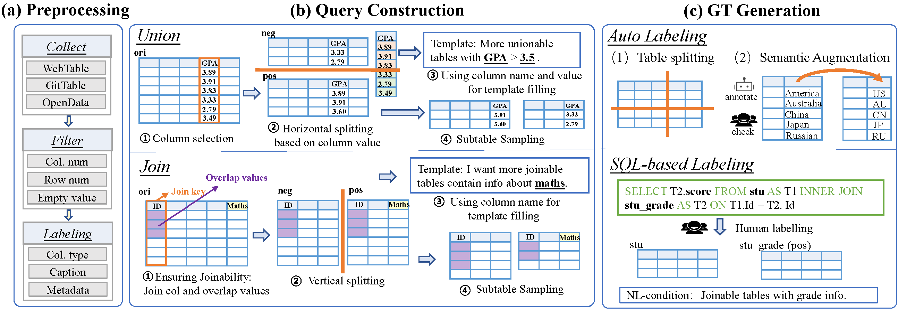

    <h1> nlcTables: A Dataset for Marrying Natural Language Conditions with Table Discovery</h1>

  <a href="#-community">Task Definition</a> •
  <a href="#-struct">Dataset construction framewok</a> •
  <a href="#-getstart">GettingStart</a> •
  <a href="#-quickstart">Dataset</a> •
  <a href="#-result">Result</a> •

We introduce a new practical scenario, **NL-conditional table discovery (nlcTD)**, where users specify both a query tableand additional requirements expressed in natural language (NL), and we provide the corresponding automated and highly configurable dataset construction framework and a large-scale dataset.  

## Task Definition

Definition 1 (NL-conditional Table Discovery). Given a table repository $\mathcal{T}$, and a user query $Q$ consisting of a query table $T^q$ and an NL request $L$, the nlcTD task aims to retrieve from $\mathcal{T}$ a top-k ranked list of tables $\mathcal{T}' = \{ T_i \}$ that are semantically relevant to both $T^q$ and $L$, as determined by a relevance scoring function, $\rho(T^q, L, T_i)$.

 

    
    
Figure 1: Illustration of NL-conditional table discovery: Combining the query table with NL conditions (e.g., high-English-GPA students) enables more precise table retrieval.

 

 

    
    
 Figure 3: The taxonomy of nlcTD, consisting of 16 NL condition subcategories along with their illustrative examples.

 
 
## Dataset construction framewok
As depicted in Figure 4, the construction process consists of three
main stages. First, we collect a large and diverse set of tables and
apply filtering to obtain high-quality original tables. Next, we adopt
table splitting to construct queries that include both NL conditions
and query tables, while simultaneously generating ground truth labels. Finally, to enhance the diversity and authenticity of the dataset,
we apply large language models (LLMs) for semantic augmentation
of the ground truths that have been generated via table splitting.
Meanwhile, we manually annotate several ground truths based on
real SQL use cases contained in the Spider dataset.

    
    
Figure 4: The three stages of constructing nlcTables: (1) Table Preprocessing: collecting, filtering, and labeling tables; (2) Query Construction: splitting tables vertically and horizontally to create joinable and unionable tables; (3) Ground Truth Generation: generating labels via automatic table splitting with semantic augmentation, and manual SQL-based labeling.

 

