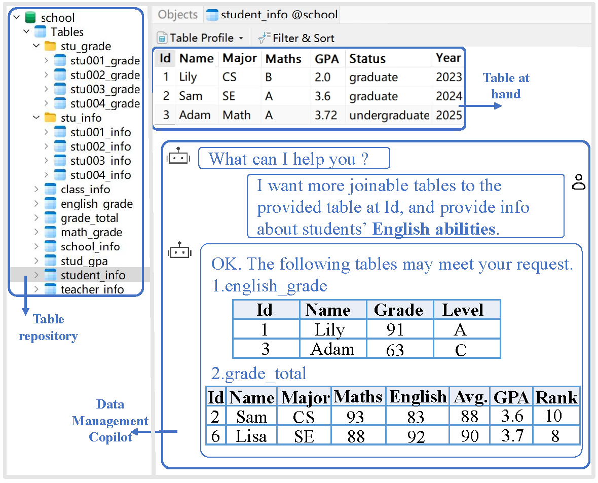

    <h1> nlcTables: A Dataset for Marrying Natural Language Conditions with Table Discovery</h1>

  <a href="#-community">Task Definition</a> •
  <a href="#-struct">Folder Structure</a> •
  <a href="#-getstart">GettingStart</a> •
  <a href="#-quickstart">QuickStart</a> •
  <a href="#-result">Result</a> •

We introduce a new practical scenario, **NL-conditional table discovery (nlcTD)**, where users specify both a query tableand additional requirements expressed in natural language (NL), and we provide the corresponding automated and highly configurable dataset construction framework and a large-scale dataset.  

## Task Definition

Definition 1 (NL-conditional Table Discovery). Given a table repository $\mathcal{T}$, and a user query $Q$ consisting of a query table $T^q$ and an NL request $L$, the nlcTD task aims to retrieve from $\mathcal{T}$ a top-k ranked list of tables $\mathcal{T}' = \{ T_i \}$ that are semantically relevant to both $T^q$ and $L$, as determined by a relevance scoring function, $\rho(T^q, L, T_i)$.

 

    
    
Figure 1: Illustration of NL-conditional table discovery: Com-
bining the query table with NL conditions (e.g., high-English-GPA students) enables more precise table retrieval.

 
 
