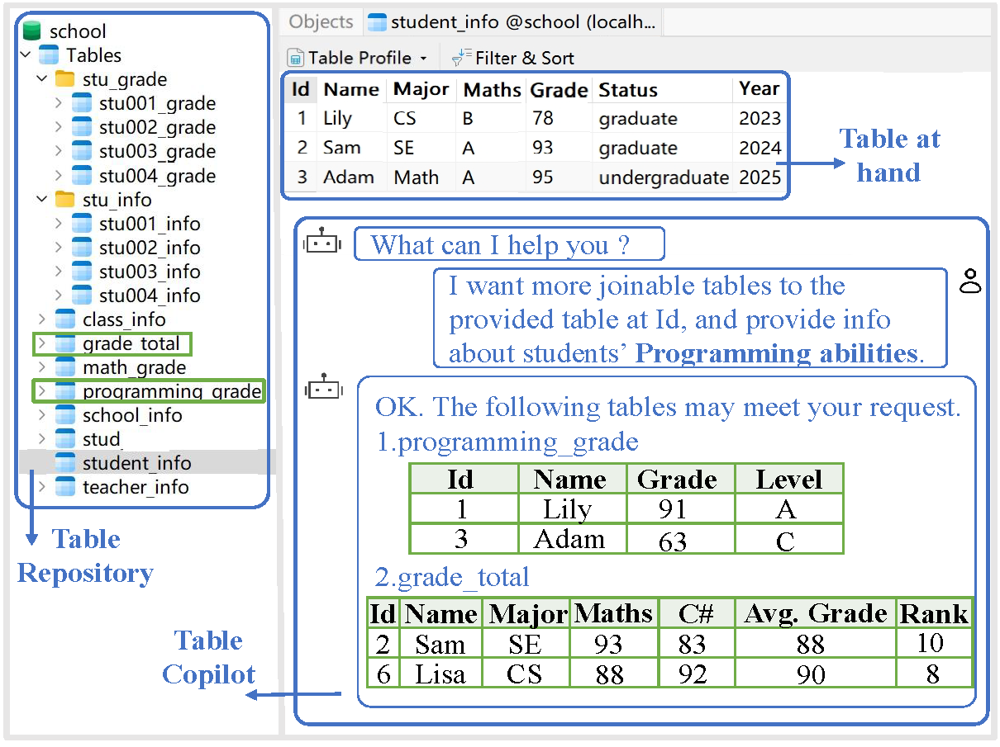
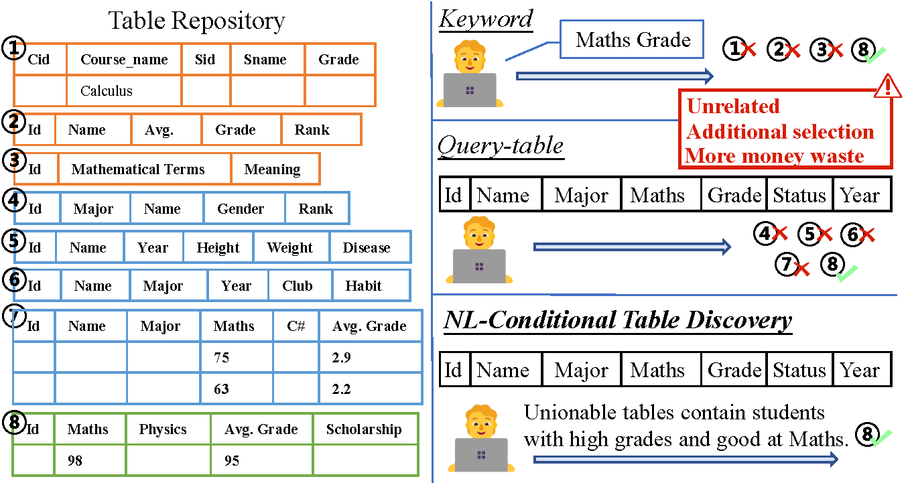
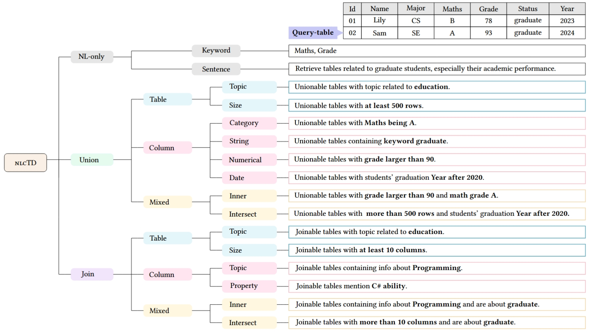
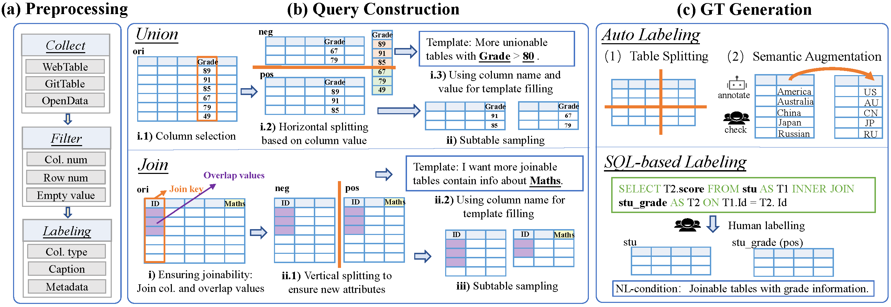
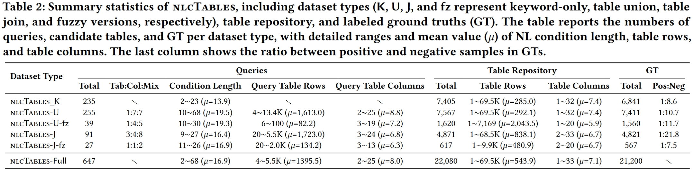

<div align= "center">
    <h1> nlcTables: A Dataset for Marrying Natural Language Conditions with Table Discovery</h1>
</div>

<p align="center">
  <a href="#-Definition">Task Definition</a> •
  <a href="#-construction">Dataset construction framewok</a> • 
  <a href="#-Dataset">Dataset</a> •
  <a href="#-getstart">GettingStart</a> •
  <a href="#-result">Result</a> •
</p>

<div align="center">
    
    <p style="font-size: 20px; font-weight: bold; margin-top: 10px;">Figure 1: Table Copilot: a typical nlcTD scenario.</p>
</div>
</div>
<br>

We introduce a new practical scenario, **NL-conditional table discovery (nlcTD)**, where users specify both a query table and additional requirements expressed in natural language (NL), and we provide the corresponding automated and highly configurable dataset construction framework and a large-scale dataset. Figure 1 depicts TableCopilot, a future paradigm of table discovery we envision, that serves as an interactive agent understanding both tables and natural language. 

<span id="-Definition"></span>
## Task Definition

Definition 1 (NL-conditional Table Discovery). Given a table repository $\mathcal{T}$, and a user query $Q$ consisting of a query table $T^q$ and an NL request $L$, the nlcTD task aims to retrieve from $\mathcal{T}$ a top-k ranked list of tables $\mathcal{T}'$ = { $T_i$ } that are semantically relevant to both $T^q$ and $L$, as determined by a relevance scoring function, $\rho(T^q,L,T_i)$.
<br>

Example 1. Imagine a teacher analyzing students’ performance
with an existing table containing information like student ID, name,
and major (as shown in Figure 2). If he directly uses this table to
search for related tables, the system might return many matches with
varying content (e.g., table ⑥ includes students’ habits), making it
challenging to find desired tables. At this point, if a condition can
be added upon the original table (such as “I want a table that can
be unioned with the original table and includes students with a high
grade.”), the retrieved tables will better satisfy user needs and thus
reducing user selection efforts.

<div align="center">
    
    <p style="font-size: 20px; font-weight: bold; margin-top: 10px; white-space: nowrap; overflow: hidden; text-overflow: ellipsis;">
        Figure 2: Illustration of NL-conditional table discovery.
    </p>
    <p style="font-size: 20px; font-weight: bold; margin-top: 10px;"> </p>
</div>
<br>

Figure 3 provides an overview of the nlcTD taxonomy with illus-
trative examples of NL conditions. We begin by treating keyword-
based table search as a simplified case of nlcTD, extending it to
form a single category. Next, we extend query-table-based search
by adding NL conditions, creating two advanced categories: NL-
conditional table union search targets rows, while NL-conditional
table join search focuses on identifying relevant columns. Each
category features distinct NL requests. Furthermore, we classify NL
conditions based on table granularity into three levels: table-level,
column-level, and mixed-mode conditions.

<div align="center">
    
    <p style="font-size: 20px; font-weight: bold; margin-top: 10px;"> Figure 3: The taxonomy of nlcTD, consisting of 16 NL condition subcategories along with their illustrative examples.</p>
</div>
<br>


<span id="-construction"></span>
## Dataset construction framework
As depicted in Figure 4, the construction process consists of three
main stages. First, we collect a large and diverse set of tables and
apply filtering to obtain high-quality original tables. Next, we adopt
table splitting to construct queries that include both NL conditions
and query tables, while simultaneously generating ground truth labels. Finally, to enhance the diversity and authenticity of the dataset,
we apply large language models (LLMs) for semantic augmentation
of the ground truths that have been generated via table splitting.
Meanwhile, we manually annotate several ground truths based on
real SQL use cases contained in the Spider dataset.

<div align="center">
    
    <p style="font-size: 20px; font-weight: bold; margin-top: 10px;">Figure 4: The three stages of constructing nlcTables: (1) Table Preprocessing: collecting, filtering, and labeling tables; (2) Query Construction: splitting tables vertically and horizontally to create joinable and unionable tables; (3) Ground Truth Generation: generating labels via automatic table splitting with semantic augmentation, and manual SQL-based labeling.</p>
</div>
</div>
<br>


<span id="-Dataset"></span>
## Dataset 
Our nlcTables supports NL-only table search (nlcTables_K), NL-conditional table union search (nlcTables-U), and NL-conditional table join search (nlcTables-J). For union and join tasks, fuzzy versions (nlcTables-U-fz and nlcTables-J-fz) are provided using
semantic augmentation. You can download these five datasets in Table 1. In total, nlcTables contains 22,080 tables
with large average size and includes 21,200 labeled GTs. The more detailed statistics are shown in Table 2.

|                 Datasets                    | Download |
| :-----------------------------------------: | :-----------------------------------------: | 
|NL-only table search (nlcTables_K)|        [Download](https://drive.google.com/drive/folders/1EsIwoBAHJXmlNoJWO50BSevJDbaj-653?usp=drive_link)     |
|NL-conditional table union search (nlcTables-U)|       [Download](https://drive.google.com/drive/folders/1uvAEzvNl6F_mW_ygv2ciJzY39WWrbg1A?usp=drive_link)       |    
|nlcTables-U-fz|       [Download](https://drive.google.com/drive/folders/1-3cUUYK0NjcfmbzNB6AifmCNJTW1oM7C?usp=drive_link)       |    
|NL-conditional table join search (nlcTables-J)|       [Download](https://drive.google.com/drive/folders/1lfmfYzDii2C4StZjKJhSdPg94dypuvJJ?usp=drive_link)       |  
|nlcTables-U-fz|       [Download](https://drive.google.com/drive/folders/10MLJg4Vu08i8NKFfyLBVbQpc3RX806PR?usp=drive_link)       |     

<div align="center">
    
    <p style="font-size: 20px; font-weight: bold; margin-top: 10px;"> </p>
</div>

<span id="-getstart"></span>
## GettingStart
This is an example of how to construct your own nlcTD datasets. Remember to change the file paths.

### Quick Start

1. Generate NL-conditional unionable table search dataset.
```sh
python union.py
```

2. Generate NL-conditional joinable table search dataset.
```sh
python join.py
```

### How to generate your own nlcTD dataset?

1. Use your own original table for splitting. You have to change your table into json file.
```sh
{
    "title": [
        "Hancock St & Cottage Ave",
        "Quincy Ave Opp President Plaza",
        "Washington St & Broad St",
        "Commercial St Opp Brookside Rd"
    ],
    "numCols": 4,
    "numericColumns": [],
    "dateColumns": [
        0,
        1,
        2,
        3
    ],
    "pgTitle": "",
    "numDataRows": 26,
    "secondTitle": "",
    "numHeaderRows": 1,
    "caption": "Bus schedule",
    "data": [
        [
            "09:00 AM",
            " ",
            "08:44 AM",
            "08:46 AM"
        ],
        [
            "08:55 AM",
            "08:51 AM",
            "08:40 AM",
            "08:42 AM"
        ],
        [
            "11:29 AM",
            " ",
            "11:12 AM",
            "11:13 AM"
        ]
    ]
}
```sh


2. Change hyper-parameter
```sh
def split_theme_table(index, json_file, query_folder, datalake_folder, query_txt, groundtruth_txt, ori_minRow=10, max_duplicate=0.1, min_split_rate=0.2, template_num=3, shuffle=1, neg_num = 10,pos_num = 5):
```sh
