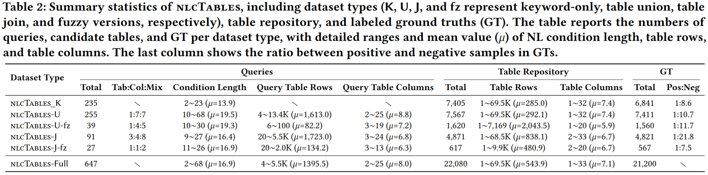

## Dataset 
Our nlcTables supports NL-only table search (nlcTables_K), NL-conditional table union search (nlcTables-U), and NL-conditional table join search (nlcTables-J). For union and join tasks, fuzzy versions (nlcTables-U-fz and nlcTables-J-fz) are provided using
semantic augmentation. You can download these five datasets in Table 1. In total, nlcTables contains 22,080 tables
with large average size and includes 21,200 labeled GTs. The more detailed statistics are shown in Table 2.

|                 Datasets                    | Download |
| :-----------------------------------------: | :-----------------------------------------: | 
|NL-only table search (nlcTables_K)|        [Download](https://drive.google.com/drive/folders/1EsIwoBAHJXmlNoJWO50BSevJDbaj-653?usp=drive_link)     |
|NL-conditional table union search (nlcTables-U)|       [Download](https://drive.google.com/drive/folders/1uvAEzvNl6F_mW_ygv2ciJzY39WWrbg1A?usp=drive_link)       |    
|nlcTables-U-fz|       [Download](https://drive.google.com/drive/folders/1-3cUUYK0NjcfmbzNB6AifmCNJTW1oM7C?usp=drive_link)       |    
|NL-conditional table join search (nlcTables-J)|       [Download](https://drive.google.com/drive/folders/1lfmfYzDii2C4StZjKJhSdPg94dypuvJJ?usp=drive_link)       |  
|nlcTables-U-fz|       [Download](https://drive.google.com/drive/folders/10MLJg4Vu08i8NKFfyLBVbQpc3RX806PR?usp=drive_link)       |     

<div align="center">
    
    <p style="font-size: 20px; font-weight: bold; margin-top: 10px;"> </p>
</div>

<span id="-getstart"></span>
## GettingStart
This is an example of how to construct your own nlcTD datasets. Remember to change the file paths.

### Quick Start

1. Generate NL-conditional unionable table search dataset.
```sh
python union.py
```

2. Generate NL-conditional joinable table search dataset.
```sh
python join.py
```

### How to generate your own nlcTD dataset?

1. Use your own original table for splitting. You have to change your table into json file.
```sh
{
    "title": [
        "Hancock St & Cottage Ave",
        "Quincy Ave Opp President Plaza",
        "Washington St & Broad St",
        "Commercial St Opp Brookside Rd"
    ],
    "numCols": 4,
    "numericColumns": [],
    "dateColumns": [
        0,
        1,
        2,
        3
    ],
    "pgTitle": "",
    "numDataRows": 26,
    "secondTitle": "",
    "numHeaderRows": 1,
    "caption": "Bus schedule",
    "data": [
        [
            "09:00 AM",
            " ",
            "08:44 AM",
            "08:46 AM"
        ],
        [
            "08:55 AM",
            "08:51 AM",
            "08:40 AM",
            "08:42 AM"
        ],
        [
            "11:29 AM",
            " ",
            "11:12 AM",
            "11:13 AM"
        ]
    ]
}
```


2. Change hyper-parameter. We have constructed several splitting fuction based on our taxonomy, for example the theme query at table level has the split_theme_table function. You can change these parameter when you call these functions.

```sh
def split_theme_table(index, json_file, query_folder, datalake_folder, query_txt, groundtruth_txt, ori_minRow=10, max_duplicate=0.1, min_split_rate=0.2, template_num=3, shuffle=1, neg_num = 10,pos_num = 5):
